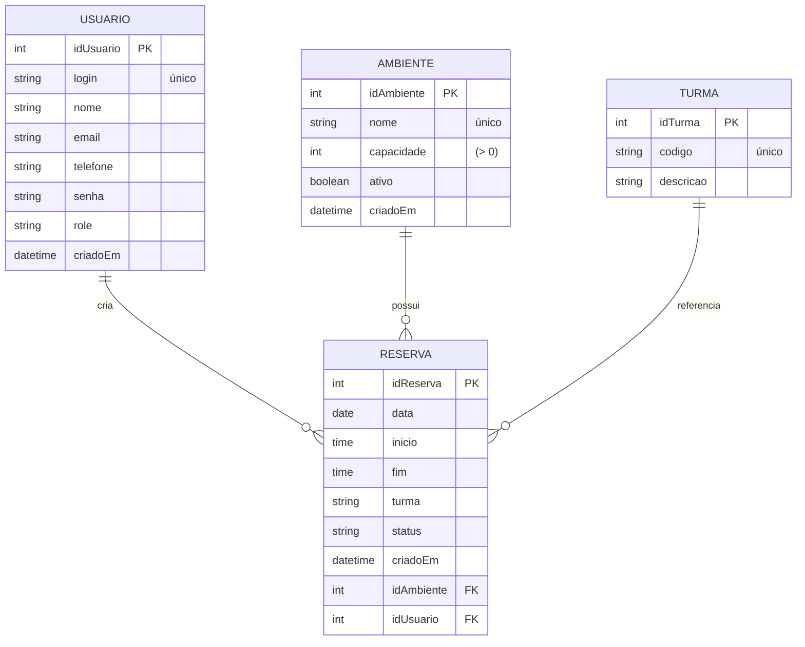

# MER — AgendaLab

Este documento apresenta o Modelo Entidade-Relacionamento do sistema AgendaLab, focado em reservas de ambientes de laboratório por usuários.

## Entidades e Atributos

- Usuario
 - Usuario
  - idUsuario (PK), login (único), nome, email, telefone, senha, role, criadoEm
- Ambiente
  - idAmbiente (PK), nome (único), capacidade (> 0), ativo, criadoEm
- Reserva
  - idReserva (PK), data, inicio, fim, turma (texto), status, criadoEm, idAmbiente (FK), idUsuario (FK)
- Turma (opcional)
  - idTurma (PK), codigo (único), descricao

## Relacionamentos e Cardinalidade

- Usuario 1 — N Reserva
  - Um usuário pode criar muitas reservas; cada reserva é criada por um usuário.
- Ambiente 1 — N Reserva
  - Um ambiente pode ter muitas reservas; cada reserva ocorre em um ambiente.
- Turma (opcional) 1 — N Reserva
  - Uma turma pode ter muitas reservas; a referência pode ser opcional conforme regras de negócio.

## Restrições de Negócio

- Unicidade de `Usuario.login` e `Ambiente.nome`.
- Validação de tempo: `inicio < fim`.
- Não sobreposição de reservas para o mesmo ambiente na mesma data (implementado via lógica no backend; índices facilitam consulta).

## Índices Sugeridos

- Reserva (idAmbiente, data, inicio, fim) — acelera detecção de conflitos e consultas.
- Reserva (idUsuario, data) — histórico por usuário.